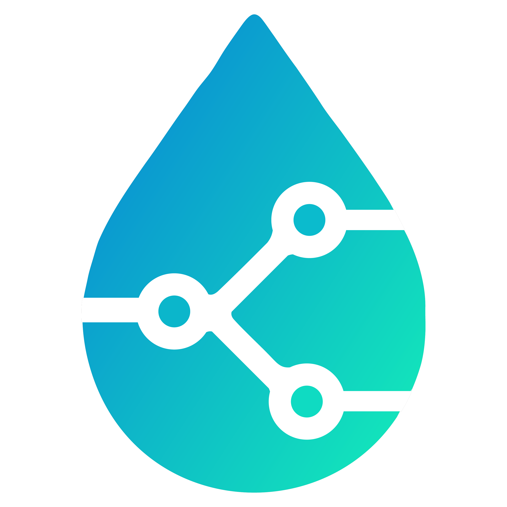

<div align="center">



# Hamilton Method Versionator

**Git-based version control for Hamilton liquid-handling robot methods**

[](LICENSE)


[](https://github.com/novozymes-digital/hamilton-venus-version-control/actions/workflows/ci.yml)

</div>

---

Hamilton Venus methods suffer from poor versioning owing to the binary encoding and hardcoded absolute paths to labware and libraries, making standard Git workflows impossible without dedicated tooling.

Hamilton Method Versionator aims to transform non-versioned Hamilton methods into fully versioned, portable methods seamlessly. It migrates methods into a standardized folder structure and rewrites internal file paths automatically. Once migrated, labware and library synchronization keeps everything version-controlled and portable across machines. All tools are packaged into a single Python-based GUI app accessible to users of all backgrounds.

> **Note on complex methods:** For simple methods the tool handles the full migration in one pass. For more complex methods with deep dependency trees, an iterative cycle may be required: run the versioning tool, test the newly versioned method on a Hamilton system, manually import any missing files into the versioned folder, run the tool again to update all paths from the new files, and test again. Repeat until the method is fully functional. This is inherent to the complexity of dependencies in large Hamilton methods: the tool resolves as much as it can automatically, but some edge cases require manual intervention.

<!-- TODO: Add a screenshot or GIF of the app showing the main tabbed interface -->
<!--
<div align="center">
  
</div>
-->

## ✨ Features

| Tool | Description |
|------|-------------|
| 📁 **Folder Architecture Creator** | Scaffold standardized versioned method directories with one click |
| 🔬 **Labware Files Sync** | Migrate `.lay` labware definitions and rewrite internal paths automatically |
| 📚 **Library Files Sync** | Recursively resolve `#include` dependencies, copy all `.hsl` libraries, and display an interactive dependency tree |
| 🔄 **File Converter** | Convert binary Venus files (`.lay`, etc.) to ASCII via Hamilton's converter |
| 🔗 **Folder Sync** | Bidirectional directory synchronization driven by a CSV path list |
| 🔍 **File Search** | Full-text search across Hamilton method files with optional trace/log inclusion |
| 📖 **Usage Guide** | In-app documentation tab |
| 💻 **CLI Mode** | Run the full versioning pipeline from the command line for scripting and scheduling |

## 📋 Table of Contents

- [✨ Features](#-features)
- [📋 Table of Contents](#-table-of-contents)
- [⚙️ Prerequisites](#️-prerequisites)
- [🚀 Quick Start](#-quick-start)
  - [Option A: Pre-built executable](#option-a-pre-built-executable-no-install-required)
  - [Option B: Run from source](#option-b-run-from-source)
- [📘 Usage](#-usage)
  - [Moving existing methods to versioning](#moving-existing-methods-to-versioning)
  - [Maintaining a versioned method](#maintaining-a-versioned-method)
  - [File Search](#file-search)
  - [GUI Interactions](#gui-interactions)
- [💻 CLI Mode](#-cli-mode)
  - [CLI Arguments](#cli-arguments)
  - [CLI Examples](#cli-examples)
  - [Testing the CLI from Source](#testing-the-cli-from-source)
- [🏗️ Architecture](#️-architecture)
  - [App backbone](#app-backbone)
  - [Folder Architecture Creator](#folder-architecture-creator)
  - [Folder Sync](#folder-sync)
  - [File Converter](#file-converter)
  - [Labware Files Sync](#labware-files-sync)
  - [Library Files Sync](#library-files-sync)
  - [File Search](#file-search-1)
- [🔧 Configuration](#-configuration)
- [📦 Building from Source](#-building-from-source)
- [🧪 Development](#-development)
- [🤝 Contributing](#-contributing)
- [🔒 Security](#-security)
- [🗺️ Roadmap](#️-roadmap)
- [⚠️ Disclaimer](#️-disclaimer)
- [📄 License](#-license)
- [🙏 Acknowledgments](#-acknowledgments)

## ⚙️ Prerequisites

- 🪟 **Windows 10/11**: Hamilton Venus is Windows-only; the app uses `pywin32` and `winshell`
- 🧪 **Hamilton Venus** installed (standard paths: `C:\Program Files (x86)\HAMILTON\`)
- 🐍 **Python 3.13** (for running from source)
- 📦 **[UV](https://docs.astral.sh/uv/)** package manager (for running from source)

## 🚀 Quick Start

### Option A: Pre-built executable (no install required)

The app is fully **portable**: no Python, no installer, no project files needed.

1. Download the following files from [Releases](../../releases) and place them in the same folder:
   - `Hamilton_Method_Versionator.exe`: GUI app
   - `Hamilton_Method_Versionator_cli.exe`: CLI app
   - `Hamilton_file_converter_headless.exe`: file converter (required dependency)
   - `README.md`: in-app documentation
2. Double-click `Hamilton_Method_Versionator.exe` to launch

Copy these 4 files to any folder on any Windows machine and they will work.

### Option B: Run from source

```bash
git clone https://github.com/novozymes-digital/hamilton-venus-version-control.git
cd hamilton-venus-version-control
uv sync
uv run python Deployment/main.py
```

## 📘 Usage

### Moving existing methods to versioning

1. Create a Git repository on your hosting platform and clone it in `C:\Program Files (x86)\HAMILTON\Versioned_methods`
2. In the app, use the **Folder Architecture Creator** tab:
   1. The destination path is the repository path you just cloned, where the new method folder will live.
   2. Method name is the name you will use for the method. Use underscores instead of spaces if using multiple words. Capital letter only on the first letter of the first word.
   3. The `.med` file to version is the path to the Hamilton method file you would like to version. It is optional to select.
   4. Press **Create folder structure** to trigger the process.
3. If you did not select a `.med` file to version:
   1. Copy the method files to the Libraries folder. Method files are `method_name.lay`, `method_name.res`, `method_name.med`, `method_name.hsl`, `method_name.sub` and `method_name.stp`.
   2. Create shortcuts for the copied files and move them to the root folder (one level above).
4. Confirm that the 6 method files above are in the versioned Libraries folder and that shortcuts for each file are present in the root folder.
5. Use **Labware Files Sync** on the root folder where the shortcuts are located to bring in the labware in the Labware folder and adjust the `.lay` file located in the Libraries folder. Do not click or close while the button is flashing.
6. Use **Library Files Sync** on the root folder where the shortcuts are located to bring in the libraries and adjust the different `.hsl` files located in the Libraries folder. Do not click or close while the button is flashing.
7. Open the method through the shortcut in the root folder:
   1. Check that the path of the layout file is correct; otherwise, change it.
   2. Confirm it runs. If errors occur, copy missing files to the appropriate folder.
8. Push to the repository. Ideally test it on another computer to confirm changes work.

### Maintaining a versioned method

1. After every session, save your work and close Venus.
2. **Labware Files Sync:** Sync the labware to make sure everything is in the versioned folder.
3. **Library Files Sync:** Sync the libraries to make sure everything is in the versioned folder.
4. Push to the repository. Ideally test it on another computer to confirm changes work.

### File Search

1. Click **Select Folder** to choose the directory to search in. The selected path is shown below the buttons.
2. Type your search string in the input field.
3. Click **Search** (or press Enter) to run the search.
4. Click any result row to select it and copy the file path to your clipboard. Click the **Line Content** cell to copy that specific line instead. A toast notification confirms every copy.

### GUI Interactions

The app uses a dark-themed web interface (pywebview) with several visual cues to keep you informed:

- **Rich log formatting**: Log areas in File Converter, Labware Sync, and Library Sync display structured lines with dimmed timestamps, colored level badges (cyan for INFO, grey for DEBUG, green for SUCCESS, amber for WARNING, red for ERROR), and clearly separated message text. Error, success, and warning messages also color the message itself for quick scanning.
- **Button flashing**: When a long-running task is active (labware sync, library sync, file conversion), the action button pulses between green and cyan so you know work is in progress. Do not close the app while a button is flashing.
- **Click-to-copy**: In the **Library Sync** dependency tree, click any node row to select it and copy its resolved path. In **File Search** results, click a row to copy the file path, or click the Line Content cell to copy that line. A toast notification appears at the bottom of the screen confirming the copy.
- **Toast notifications**: Brief confirmation messages slide up from the bottom when content is copied to the clipboard.
- **Dependency tree**: After a library sync, the dependency tree is displayed with expand/collapse nodes. Green nodes are resolved (file found), red nodes are unresolved (may need manual intervention). Hover over a node to see its full path.
- **Status badges**: On the Folder Sync tab, the monitoring status is shown as a colored pill badge (blue = ready, green = running, red = stopped).

## 💻 CLI Mode

The app includes a command-line interface for power users who want to script or schedule the versioning workflow without the GUI. When arguments are passed, the app runs in CLI mode; with no arguments, the GUI launches as usual.

The CLI runs the same backend functions as the GUI tabs (labware sync, library sync, and file conversion) in a single-threaded, sequential pipeline.

### CLI Arguments

| Argument | Required | Description |
|----------|----------|-------------|
| `--method-root` | Yes | Path to versioned method root folder (must contain `Libraries/`) |
| `--hsl` | Yes | Path to the actual `.hsl` file inside `Libraries/` (not a shortcut, see note below) |
| `--skip-labware` | No | Skip the labware sync step |
| `--skip-library` | No | Skip the library sync step |
| `--skip-conversion` | No | Skip file conversion steps (initial and final) |
| `--continue-on-error` | No | Log errors and keep going instead of aborting |
| `--verbose` | No | Enable DEBUG-level console output |

### CLI Examples

```powershell
# Full versioning pipeline (labware + library sync with file conversion)
Hamilton_Method_Versionator_cli.exe --method-root "C:\...\MyMethod" --hsl "C:\...\MyMethod\Libraries\MyMethod.hsl"

# Library sync only (skip labware)
Hamilton_Method_Versionator_cli.exe --method-root "C:\...\MyMethod" --hsl "C:\...\MyMethod\Libraries\MyMethod.hsl" --skip-labware

# Skip file conversion (useful if files are already in ASCII)
Hamilton_Method_Versionator_cli.exe --method-root "C:\...\MyMethod" --hsl "C:\...\MyMethod\Libraries\MyMethod.hsl" --skip-conversion

# Best-effort mode: continue even if a step fails
Hamilton_Method_Versionator_cli.exe --method-root "C:\...\MyMethod" --hsl "C:\...\MyMethod\Libraries\MyMethod.hsl" --continue-on-error
```

Exit codes: `0` = success, `1` = failure.

> **Note:** The GUI allows you to select a `.hsl` shortcut (`.lnk`) from the root folder; it resolves the shortcut automatically. The CLI does **not** resolve shortcuts, so you must pass the real file path (e.g., `...\Libraries\MyMethod.hsl`), not the shortcut.

### Testing the CLI from Source

Before packaging into an `.exe`, you can test the CLI directly with Python:

```powershell
cd Deployment
python main.py --help
python main.py --method-root "C:\path\to\method" --hsl "C:\path\to\method\Libraries\MyMethod.hsl"
```

Or using UV from the repository root:

```powershell
uv run python Deployment/main.py --help
uv run python Deployment/main.py --method-root "C:\path\to\method" --hsl "C:\path\to\method\Libraries\MyMethod.hsl"
```

## 🏗️ Architecture

The repository has the following top-level folders:

| Folder | Purpose |
|--------|---------|
| `Deployment/` | Production codebase (~3,000 lines across 17 modules) |
| `Data/` | App resources, config, logs, and assets |
| `tests/` | Test suite |
| `docs/` | MkDocs documentation source |

The app is a tabbed GUI (`pywebview` + HTML/CSS/JS frontend) where each tab maps to a backend module:

```
main.py ─┬─ (no args) → webgui/ (pywebview app shell + JS frontend)
         │                ├── app.py (window setup)
         │                ├── api.py (Python ↔ JS bridge)
         │                ├── log_bridge.py (real-time log streaming)
         │                └── assets/ (index.html + custom.css + app.js)
         │                    Backend modules:
         │                    ├── folder_structure_creator.py
         │                    ├── monitoring.py → file_operations.py + csv_operations.py
         │                    ├── file_converter.py
         │                    ├── labware_sync.py
         │                    ├── library_path_updater.py
         │                    └── string_search.py
         │
         └─ (with args) → cli.py (sequential pipeline)
                          ├── file_converter.py
                          ├── labware_sync.py
                          └── library_path_updater.py
```

<details>
<summary><strong>Detailed module descriptions</strong></summary>

### App backbone

- **`main.py`**: Entry point that routes to GUI (no args) or CLI mode (with args).
- **`cli.py`**: CLI workflow engine. Argparse-based interface that runs the versioning pipeline (conversion, labware sync, library sync) sequentially on the main thread.
- **`webgui/`**: Web-based GUI package using `pywebview`. `app.py` creates the window, `api.py` exposes Python functions to JavaScript, `log_bridge.py` streams real-time logs to the frontend, and `assets/` contains the HTML/CSS/JS frontend (dark-themed, single-page app with tabbed navigation).
- **`logger_config.py`**: Sets up the logging process. A common log is used for all actions performed in the app, separate from the temporary logs used for displaying logs inside the GUI. Logs are generated based on the CPU id of the computer and stored in the Data folder. If errors are detected, an email with a copy of the logs will be sent to the configured email address.
- **`email_log_handler.py`**: Houses the code enabling email of logs in case of errors.
- **`launch_hidden.vbs`**: Visual Basic script allowing one-click windowless execution of the batch file below.
- **`run_app.bat`**: Batch file to run the app using the UV environment.

### Folder Architecture Creator

- **`folder_structure_creator.py`**: Creates a predefined folder structure (Libraries, Labware, Documentation, etc.) for the selected method within the destination path. Creates a `README_method.md` in the root method folder with detailed information about the folder structure. Generates shortcut files to key method files (`.med`, `.hsl`, `.lay`) in the root folder for easier access.

### Folder Sync

- **`monitoring.py`** + **`file_operations.py`** + **`csv_operations.py`**: Synchronizes the content of two folders using a CSV list of paths (`paths_to_monitor.csv`). Identifies and skips temporary files (`.tmp`, `~$`). Builds sets of relative paths for source and destination directories to determine files to copy, update, or delete. Preserves metadata during copy operations.

### File Converter

- **`file_converter.py`**: Enables conversion of non-readable Venus files (e.g., `.lay`) to ASCII format using Hamilton's converter software. Requires a 32-bit environment, so the Python code is packaged into `Hamilton_file_converter_headless.exe`. Handles read-only file locks that might prevent conversion.

### Labware Files Sync

- **`labware_sync.py`**: Processes `.lay` files by copying associated labware files to a dedicated Labware folder and updating internal paths. Copies base ML_STAR folder files to ensure the method runs without errors. Handles ASCII and non-ASCII character validation. Also processes `.rck` and `.tml` files to update labware paths.

### Library Files Sync

- **`library_path_updater.py`**: Finds all libraries used in a method recursively by following `#include` statements. Copies all referenced `.hsl` files to the Library folder and updates include paths to absolute paths. Includes safety guards (max recursion depth, resolved-path deduplication, cycle detection) and exposes a framework-agnostic `to_dict()` method for tree rendering. The GUI displays the dependency tree as an interactive collapsible tree with click-to-select and copy-to-clipboard. Nodes are colour-coded: **green** means the dependency was found on disk and successfully resolved, **red** means the file could not be located (unresolved) and may need manual intervention.

### File Search

- **`string_search.py`**: Scans all files within a selected folder, excluding trace and log files (`.trc`, `.log`, `.txt`, `.adp`) by default. A checkbox enables searching those auxiliary files too. Performs case-insensitive search with results displayed in a table showing file path, line number, and line content.

</details>

## 🔧 Configuration

The app stores settings in `Data/config.json`. On first run, defaults are used.

| Setting | Default | Description |
|---------|---------|-------------|
| `smtp_server` | `""` (disabled) | SMTP server for error email notifications |
| `smtp_port` | `25` | SMTP port |
| `smtp_sender` | `""` | Sender email address |
| `smtp_recipient` | `""` | Recipient for error notifications |
| `smtp_use_tls` | `false` | Enable TLS encryption |

Email notifications are disabled by default and activate only when all SMTP fields are configured.

## 📦 Building from Source

1. Ensure you have UV installed and available in your PATH.
2. Navigate to the `Hamilton_versioning_app` directory in your terminal.
3. Run the following command to generate the executables:

   ```powershell
   uv run pyinstaller --distpath . Deployment/Hamilton_Method_Versionator.spec
   ```

4. This produces **two executables**:
   - `Hamilton_Method_Versionator.exe`: GUI mode (no console window)
   - `Hamilton_Method_Versionator_cli.exe`: CLI mode (console attached for terminal output)
5. The `pathex` in [`Deployment/Hamilton_Method_Versionator.spec`](Deployment/Hamilton_Method_Versionator.spec) is set to `'.'` (current directory). Run PyInstaller from the repository root so that paths resolve correctly.
6. The distribution folder needs to contain all 3 `.exe` files and `README.md`. Ensure the `README.md` is up to date. See [Option A: Pre-built executable](#option-a-pre-built-executable-no-install-required) for the full list.

## 🧪 Development

Clone, sync and run the same checks CI runs:

```powershell
uv sync --frozen
uv run pytest              # test suite, with coverage
uv run ruff check .        # lint
uv run ruff format --check .
```

The test suite imports Windows-only modules (`pywin32`) and drives the Hamilton
converter as a subprocess, so it runs on Windows. Linting and formatting run on
any platform. CI runs the tests on `windows-latest` and a TruffleHog secret scan
on every push.

## 🤝 Contributing

Contributions are welcome! See [CONTRIBUTING.md](CONTRIBUTING.md) for guidelines on:

- Reporting bugs and suggesting features
- Setting up a development environment
- Submitting pull requests

**Before you start:** this GitHub repository is a published mirror whose history
is replaced on every release. That changes what happens to your commits, so read
[how this repository relates to ours](CONTRIBUTING.md#how-this-repository-relates-to-ours)
first.

Please read our [Code of Conduct](CODE_OF_CONDUCT.md) before participating.

## 🔒 Security

Please do **not** open a public issue for a security vulnerability. See
[SECURITY.md](SECURITY.md) for the private reporting route and what to expect.

## 🗺️ Roadmap

No fixed roadmap: the tool covers the workflow it was built for. Feature
requests and bug reports are welcome through
[GitHub Issues](../../issues/new), and the [CHANGELOG](CHANGELOG.md) records
what has shipped.

## ⚠️ Disclaimer

This project is community-built and **not officially affiliated with, endorsed by, or supported by Hamilton Company**. Hamilton and Venus are trademarks of Hamilton Company. Use at your own discretion.

## 📄 License

This project is licensed under the Apache License 2.0, see the [LICENSE](LICENSE) file for details.

## 🙏 Acknowledgments

Built with [pywebview](https://pywebview.flowrl.com/), [Loguru](https://github.com/Delgan/loguru), [UV](https://docs.astral.sh/uv/), and [PyInstaller](https://pyinstaller.org/).
